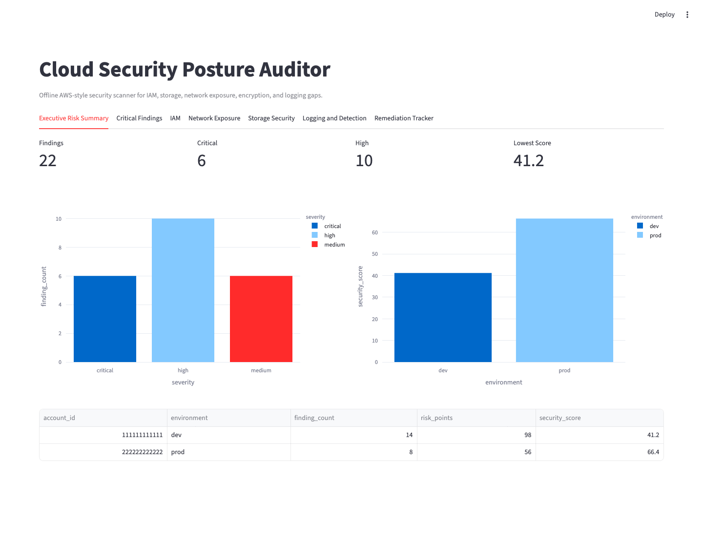
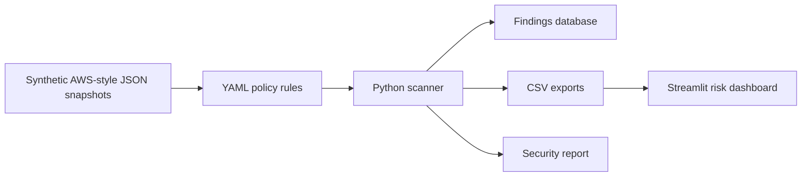

# Cloud Security Posture Auditor

[](https://github.com/HaloXD1/cloud-security-posture-auditor/actions/workflows/tests.yml)

Cloud security automation portfolio project that scans synthetic AWS-style account snapshots for IAM, S3, security group, database, encryption, and logging risks.

## Safety

This project uses offline synthetic JSON snapshots by default. No real AWS credentials are required, loaded, or committed.

## Live Demo

Streamlit Cloud URL: _add after deployment._

The dashboard bootstraps synthetic snapshots and scan outputs automatically if generated files are missing.



## Architecture



## Checks

- IAM users without MFA
- Old IAM access keys
- Direct admin user policies
- Wildcard IAM permissions
- Overly broad trust policies
- Public S3 buckets
- Missing S3 encryption or versioning
- Public risky security-group ingress
- Public RDS-style databases
- Missing CloudTrail-style logging
- Missing GuardDuty-style detection
- Unencrypted storage volumes

## Local Run

```bash
python3 -m venv .venv
source .venv/bin/activate
pip install -e ".[dev]"
cloud-audit generate-snapshots
cloud-audit scan --source snapshots
streamlit run app/streamlit_dashboard.py
```

## Docker

```bash
docker compose up dashboard
docker compose run --rm auditor cloud-audit scan --source snapshots
```

## Testing

```bash
ruff check .
ruff format --check .
pytest --cov=src/cloud_audit --cov-report=term-missing --cov-fail-under=85
```

## Docs

- [Architecture](docs/architecture.md)
- [Rules reference](docs/rules_reference.md)
- [Security report](docs/security_report.md)
- [Remediation plan](docs/remediation_plan.md)
- [Interview guide](docs/interview_guide.md)
- [AWS live mode later](docs/aws_live_mode_later.md)

## CV Bullets

- Built a cloud security posture auditor that scans AWS-style IAM, storage, network, encryption, and logging configurations using YAML policy rules and Python automation.
- Implemented risk scoring, severity-based findings, remediation reports, and a Streamlit dashboard for identifying public exposure, weak IAM controls, missing encryption, and logging gaps.
- Added synthetic cloud snapshots, CI tests, Docker support, secret scanning, and documentation so the project is safe to publish and easy to explain.
