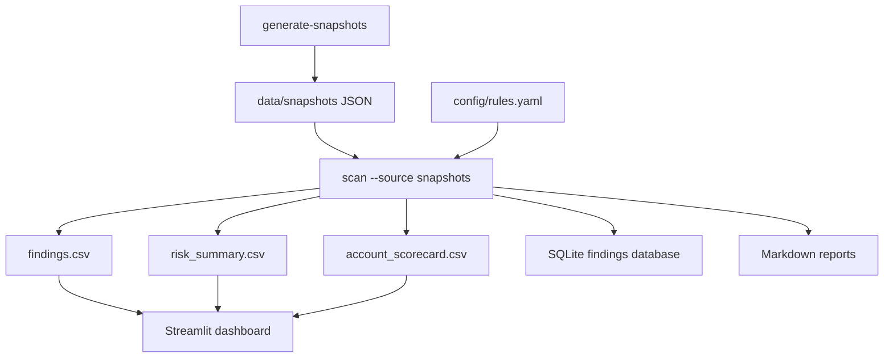

# Architecture

The project is intentionally offline-first so it is safe to publish and easy for recruiters to run.

## Components

- `config/rules.yaml`: policy-as-code rules with severity, explanation, remediation, and compliance tag.
- `data/snapshots`: generated synthetic AWS-style JSON account snapshots.
- `src/cloud_audit/scan.py`: evaluates snapshots, creates findings, scores risk, exports reports.
- `src/cloud_audit/health.py`: verifies required exports, score thresholds, and count integrity.
- `app/streamlit_dashboard.py`: recruiter-facing dashboard that bootstraps demo outputs.

## Public Safety

The default scanner never calls AWS APIs. Future live mode should require explicit `--source aws`, read-only permissions, and documented profile usage.
